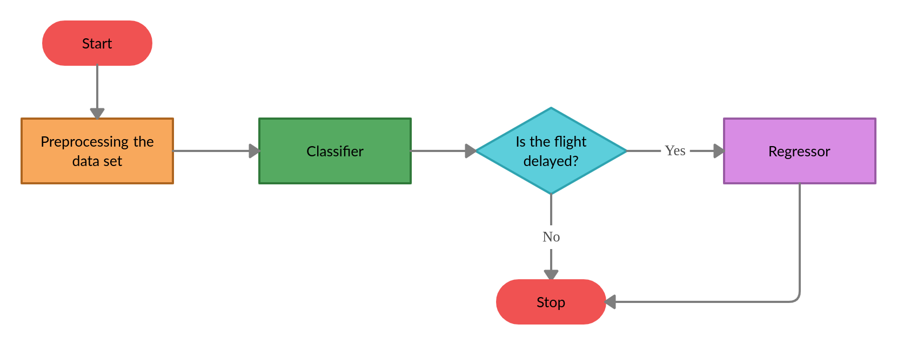

# Flight Delay Prediction

A two-stage predictive machine learning engine that forecasts the on-time performance of flights for 15 different airports in the USA based on data collected between 2016 and 2017.

- Check out the two-stage machine learning model [here!](./12_Pipelined_Model.ipynb)  
- Check out the details of the project in this [Report!](./Report/Two_Stage_Flight_Delay_Prediction_Report.pdf)  

## Abstract

Flights are said to be delayed when they arrive later than the scheduled arrival time. This delay is predominantly influenced by environmental conditions. Flight delay is vexatious for passengers and also incurs an agonizingly high financial loss to airlines and countries.  
A structured prediction system is an indispensable tool to help aviation authorities effectively alleviate flight delays.  
This project aims to build a two-stage machine learning engine to effectively predict the arrival delay of a flight.

## Features
- Flight data processing  
- Weather data processing  
- Merging flight & weather datasets  
- Classification models with imbalance handling  
- Regression models  
- Pipelined model for inference  

## Tech Stack
- Python  
- Jupyter Notebook  
- Scikit-learn  
- Pandas / Numpy  
- Matplotlib / Seaborn  

## Author
**Rohit Sharma**  
📧 Email: [scriptedbyrohitsharma@gmail.com](mailto:scriptedbyrohitsharma@gmail.com)  
🌐 GitHub: [rohitshrma11](https://github.com/rohitshrma11)
